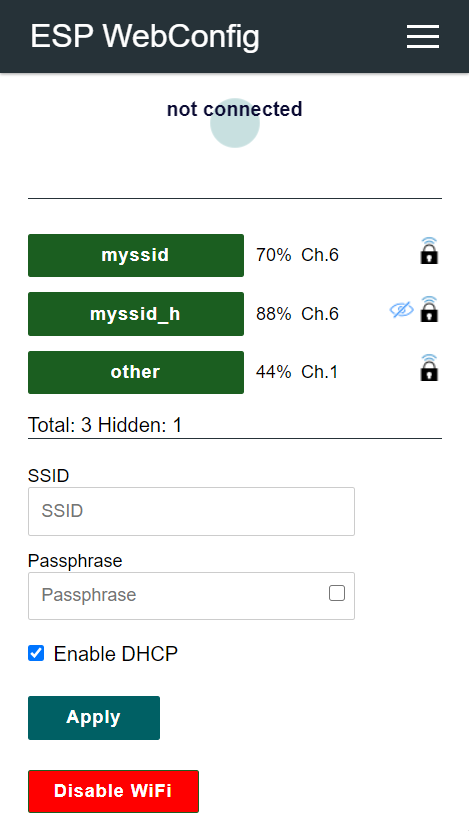
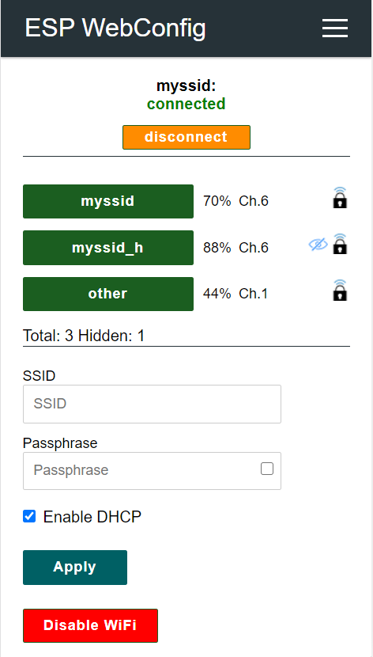
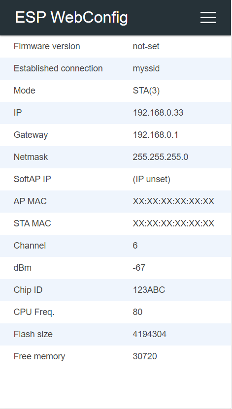
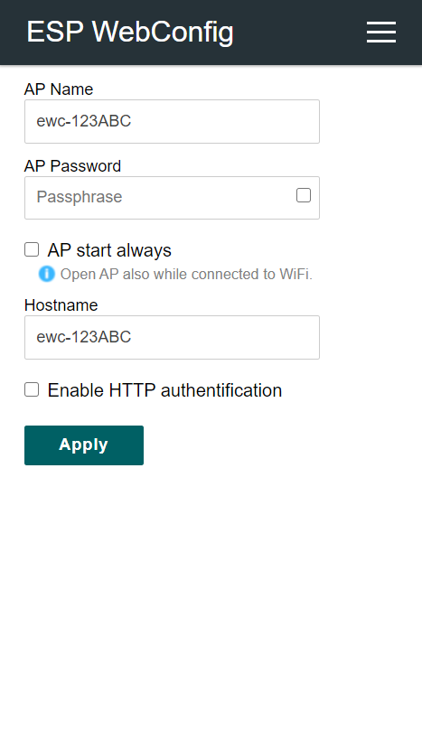
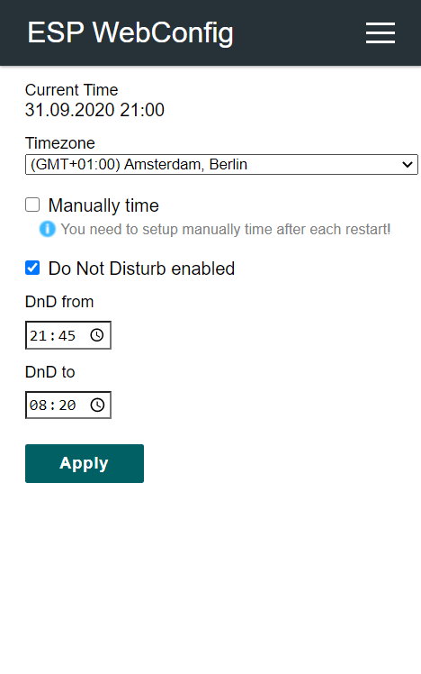
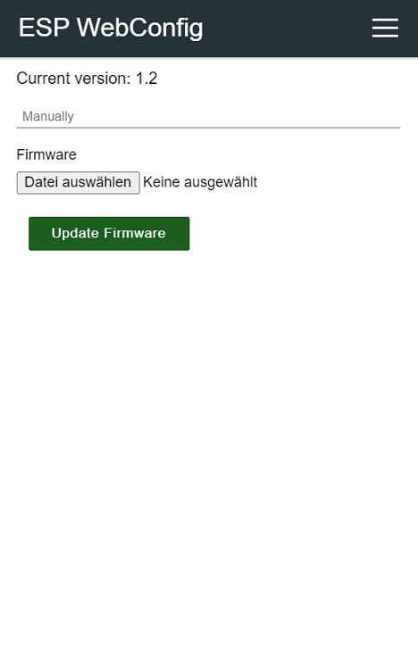
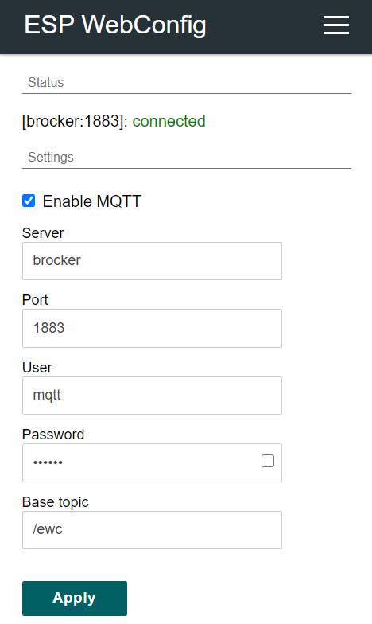
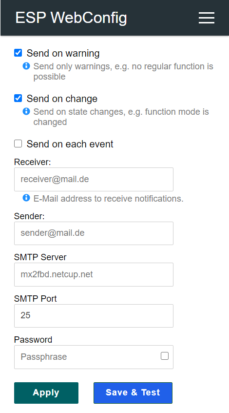

# ESP8266/ESP32 Web Configuration

Yet another library web configuration library for ESP8266.

## Why another

There are already many cool web-based configuration libraries out there, but I haven't found one that suits all my needs. Some of these libraries are [AutoConnect](https://github.com/Hieromon/AutoConnect), [ESPAsyncWiFiManager](https://github.com/alanswx/ESPAsyncWiFiManager), [Homie](https://github.com/homieiot/homie-esp8266), [IoTWebConf](https://github.com/prampec/IotWebConf),  [JeeUI](https://github.com/jeecrypt/JeeUIFramework), [JeeUI2](https://github.com/jeecrypt/JeeUI2), [WiFiManager](https://github.com/tzapu/WiFiManager) or [ESPUI](https://github.com/s00500/ESPUI). The restrictions caused by blocking the startup process, the number of user-defined parameters, customizing websites or heap hunger are reasons for the development of this library.

## Features

- Modern web design // _based on [AutoConnect](https://github.com/Hieromon/AutoConnect)_
- Simple integration into your sketch
- No blocking, even if not yet connected
- Increased stability by avoiding AsyncWebServer
- Pages are filled on the client site by JavaScript
- Logging using __<<-operator__ // _based on [Homie](https://github.com/homieiot/homie-esp8266)_
- Reset configuration by double press on reset button // _based on https://github.com/datacute/DoubleResetDetector_
- Interface to store runtime data in RTC memory.
- Option to add own languages.
- Extensions for __OTA Update__, __MQTT__, __Time__ or __E-Mail__ setup pages.
- Optional: [MQTT Homie](https://homieiot.github.io) integration for simple setup of property discovery.
- Create you own pages and test the functionality with a webserver of your choice. Include the HTML, CSS, JS or SVG files as auto generated header files // _based on [ESPUI](https://github.com/s00500/ESPUI)_

## Installation

This library was written using [PlatfromIO](https://platformio.org/) in [Visual Studio Code](https://code.visualstudio.com/).

Extend your _platromio.ini_ with:
```ini
[env:d1_mini]
platform = espressif8266
board = d1_mini
framework = arduino
upload_speed = 115200
monitor_speed = 115200
build_flags = -D PIO_FRAMEWORK_ARDUINO_LWIP2_LOW_MEMORY
board_build.filesystem = littlefs
lib_deps =
    ArduinoJson
    AsyncMqttClient
    Ticker
    ESPWebConfig=https://github.com/atiderko/espwebconfig.git
```

To add your own pages you need to put the html file into __web__ folder.
For header generation while build extend your _platromio.ini_ with:
```ini
extra_scripts = pre:pre_build.py
```
and add the script file __pre_build.py__ with (for header generation from HTML, JS, JSON or SVG files we use __python__ with __htmlmin__, __jsmin__ and __csscompressor__; we check and install they if needed):
```python
Import("env")
try:
    import jsmin
    import htmlmin
    import csscompressor
except ImportError:
    env.Execute("$PYTHONEXE -m pip install htmlmin jsmin csscompressor")
env.Execute("$PYTHONEXE $PROJECT_DIR/.pio/libdeps/d1_mini/espwebconfig/scripts/generate_headers.py -p $PROJECT_DIR -n")
```

See [BBS](https://github.com/atiderko/bbs) project for example integration.

## Integration

Below you see the simplest sketch with full functionality.

```cpp
#include <Arduino.h>
#include <ewcConfigServer.h>

EWC::ConfigServer server;

void setup() {
    Serial.begin(115200);
    // start webserver
	server.setup();
}


void loop() {
    // process dns requests and connection state AP/STA
    server.loop();
    if (WiFi.status() == WL_CONNECTED) {
        // do your stuff if connected
    } else {
        // or if not yet connected
    }
    delay(1);
}
```
On first start it creates a captive portal where you can enter your credentials to connect to your WiFi. The credentials are stored by Arduino WiFi library. WiFi setup URI: __/wifi/setup__

&emsp;

Default _Info_ (/ewc/info) and _Access-Configuration_ (/access/setup) pages:

&emsp;

## Extensions

&emsp;&emsp;&emsp;

- [Time integration](docs/time.md)
- [Updater integration](docs/updater.md)
- [MQTT integration](docs/mqtt.md)
- [Mail integration](docs/mail.md)

## Language customization

Copy _web/languages.json_ to _web_ folder of your project. Extend/replace the content of the JSON file with your launguage.
Add following code to your code.

```cpp
#include "generated/webLanguagesJSON.h"

void setup()
    // ... other content
    EWC::I::get().config().paramLanguage = "de";
    EWC::I::get().server().webserver().on("/languages.json", std::bind(&EWC::ConfigServer::sendContentP, &EWC::I::get().server(), &EWC::I::get().server().webserver(), FPSTR(PROGMEM_CONFIG_APPLICATION_JSON), JSON_WEB_LANGUAGES));
    // ... other content
}
```

## Favicon.ico

Upload a __favicon.ico__ with ```pio run --target uploadfs```